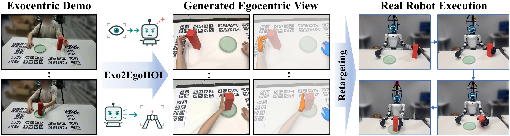

# Exo2EgoHOI: Hand-Object-Interaction Aware Exocentric-to-Egocentric Video Generation

  <a href="https://scholar.google.com/citations?user=alXpF8wAAAAJ">Hongjia Zhai</a>1,
  <a href="https://scholar.google.com/citations?user=4daSiAwAAAAJ">Xiyu Zhang</a>2,
  <a href="https://scholar.google.com/citations?user=BrA5fjoAAAAJ">Haoran Zhang</a>1,
  <a href="https://scholar.google.com/citations?user=EFs5B9IAAAAJ&amp;hl=zh-CN">Zhichao Ye</a>3,
  <a href="https://scholar.google.com/citations?user=SeErxokAAAAJ&amp;hl=en">Haomin Liu</a>3, 
  <a href="https://scholar.google.com/citations?user=F0xfpXAAAAAJ">Guofeng Zhang</a>2,3,
  <a href="https://scholar.google.com/citations?user=ATkNLcQAAAAJ">Ian Reid</a>1,
  <a href="https://scholar.google.com/citations?user=CePv8agAAAAJ">Xingxing Zuo</a>1

  1MBZUAI &nbsp;&nbsp; 2Zhejiang University &nbsp;&nbsp; 3InSpatio

  arXiv (coming soon) · Paper PDF (updated file pending) · <a href="https://rcl-robotics.github.io/Exo2EgoHOI/">Project Page</a> · <a href="https://github.com/RCL-Robotics/Exo2EgoHOI">GitHub</a>

## Overview

Exo2EgoHOI generates first-person videos of human manipulation from third-person demonstrations while preserving the observed hand-object interaction. It combines a unified 4D hand-object interaction prior with object-centric appearance guidance to maintain hand motion, contact, and object identity across viewpoint changes.

## Abstract

Egocentric videos of human manipulation provide valuable visual experience for embodied intelligence, yet collecting such data at scale is costly. Exocentric-to-egocentric video generation offers a scalable alternative by transforming abundant third-person manipulation videos into first-person observations. However, existing methods often struggle to faithfully preserve demonstrated hand-object interactions (HOI) across large viewpoint changes due to insufficient fine-grained interaction guidance and weak object-centric anchoring. We present Exo2EgoHOI, an HOI-aware video generative framework for interaction-preserving exocentric-to-egocentric translation. To preserve fine-grained HOI, we introduce a unified 4D HOI prior that combines scene geometry, articulated hand renderings, and dense hand-object relation fields, together with a dual-branch residual adapter for injecting structural and relational cues into the video generation backbone. To preserve object consistency, we introduce Decomposed Gated Cross-Attention, which separately encodes object and background references and adaptively integrates global semantic and local appearance features as object-centric anchors. Experiments on ARCTIC-HOI and Ego-Exo4D demonstrate substantial improvements in object consistency and HOI preservation while maintaining competitive visual fidelity. In particular, on ARCTIC-HOI, Exo2EgoHOI improves object mIoU by 32.3% and reduces MPJPE and PA-MPJPE by 34.7% and 50.0%, respectively, relative to the respective best baseline results.

## Highlights

- A unified 4D HOI prior represents scene geometry, articulated hands, and hand-object relations in the target view.
- Decomposed Gated Cross-Attention uses object and background references to help preserve object appearance through viewpoint changes.
- Evaluation on ARCTIC-HOI and Ego-Exo4D measures visual fidelity, object consistency, and hand-pose consistency.
